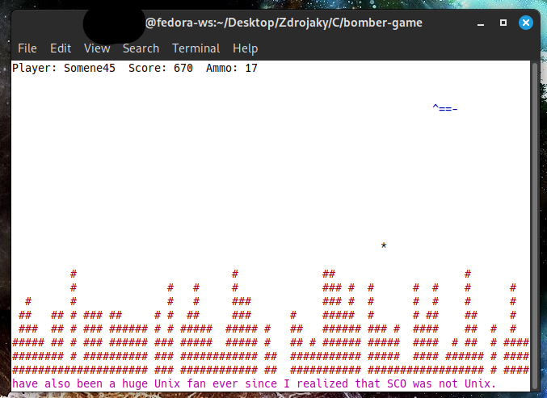

# Bomber Game

A terminal-based bombing game written in C using ncurses. Control a plane that drops bombs to destroy the city below!

Written and teste on Fedora 42 Cinnamon.

 
*(Bomber running)*

## Features
- **Zig-zag bomber movement** with directional flipping
- **Area-of-effect bombs** (3-block damage radius)
- **Destructible city terrain**
- **Score and player name tracking** with scorefile
- **Smooth animations** with optimized rendering
- **Score system** (10 points per block destroyed)
- **Simple controls** (Down key to bomb, Space to shoot from machine gun, Q to quit)
- **Help screen and pause** (H and P)
- **Colored gameplay and scrolling qoutes**

## How to Play
1. **Compile**:  
   ```bash
   make
   ```
2. **Run**:  
   ```bash
   ./bomber
   ```
3. **Controls**:  
   - `Space` = Drop bomb  
   - `H` = Help screen  
   - `Q` = Quit game  

## Game Rules
- Destroy all city blocks (`#`) to win
- Crash into the city → Game Over
- Bomber automatically:
  - Moves left/right
  - Descends when hitting edges
  - Flips direction (`^==-` ↔ `-==^`)
  - 17 bullets in magazine

## Customization
Edit `bomber.c` to change:
```c
#define DAMAGE_RADIUS 1    // Increase for bigger explosions
struct timespec ts_bomb   // Adjust bomb speed (nanoseconds)
int world[COLS]           // Modify city generation
```

## Dependencies
- Unix-like OS (Linux,MacOS,FreeBSD)
- fortune tool (comes preinstalled with all of Linux and FreeBSD)
- `ncurses` library  
  Install with: 
  - Fedora: `sudo dnf install ncurses`
  - Ubuntu: `sudo apt install libncurses-dev`
  - Mac: `brew install ncurses`

